<div align="center">


<br>


<br><br>


---

# 🛡️ KAVACH

### Enterprise Banking Security Operations Center

### Detect • Monitor • Investigate • Protect

<p>

An enterprise-grade Security Operations Center (SOC) dashboard designed for monitoring privileged employee activities, managing insider threats, auditing security events, and visualizing organizational risk in real time.

Developed for **Finspark Hackathon 2026**.

</p>

<br>

<a href="https://github.com/Muskan377750/Kavach">

</a>

<a href="https://drive.google.com/file/d/1WUl_NhfI6qjfHs9AFAwB--n7jSaRj906/view?usp=drive_link">

</a>

<a href="mailto:m13347555@gmail.com">

</a>

</div>

---

<h2 align="center">⚡ Quick Navigation</h2>

<p align="center">

<a href="#project-overview">
  
</a>

<a href="#live-demonstration">
  
</a>

<a href="#product-showcase">
  
</a>

<a href="#core-modules">
  
</a>

<a href="#system-architecture">
  
</a>

<br><br>

<a href="#technology-stack">
  
</a>

<a href="#project-structure">
  
</a>

<a href="#installation-guide">
  
</a>

<a href="#project-statistics">
  
</a>

<a href="#roadmap">
  
</a>

<br><br>

<a href="#meet-the-team">
  
</a>

<a href="#license">
  
</a>

</p>

---

# 🌟 Why KAVACH?

> Traditional security dashboards only display logs.

> **KAVACH** goes further by combining **employee monitoring**, **privileged access tracking**, **incident investigation**, **audit intelligence**, **analytics**, and **role-based management** into one centralized enterprise-grade dashboard.

Built with modern web technologies and an enterprise UI, KAVACH provides Security Operations Center (SOC) teams with a streamlined interface to identify suspicious behaviour and monitor organizational security posture.

---

# 🚀 Enterprise Highlights

<div align="center">

| 🛡 Enterprise Security | 📊 Real-Time Analytics | 🚨 Live Monitoring |
|:---------------------:|:----------------------:|:------------------:|
| Privileged Access Monitoring | Interactive Dashboards | Threat Intelligence |

| 👥 Employee Intelligence | 📁 Audit Center | 📈 Reports |
|:-----------------------:|:--------------:|:----------:|
| Risk Profiling | Security Logs | Export Analytics |

</div>

---

# Project Overview 

| Feature | Status |
|----------|--------|
| Enterprise Dashboard | ✅ |
| Employee Risk Monitoring | ✅ |
| Threat Intelligence | ✅ |
| Alert Management | ✅ |
| Audit Logging | ✅ |
| Reports | ✅ |
| Security Analytics | ✅ |
| Responsive Design | ✅ |
| JWT Authentication | ✅ |
| Dark Enterprise Theme | ✅ |

---

# Project Metrics

<div align="center">

| 🚀 Metric | Value |
|-----------|-------|
| 📄 Pages | 8+ |
| 🧩 Components | 40+ |
| 📊 Charts | 8 |
| 🔐 Authentication | JWT |
| 👥 Modules | 10+ |
| 📱 Responsive | 100% |
| 🌙 Theme | Dark Enterprise |
| ⚡ Performance | Optimized |

</div>

---
# Live Demonstration

<div align="center">

### 🚀 Experience KAVACH in Action

<p>
Watch the complete walkthrough of the Enterprise Banking Security Operations Center.
</p>

<a href="https://drive.google.com/file/d/1WUl_NhfI6qjfHs9AFAwB--n7jSaRj906/view?usp=drive_link">


</a>

---

> **The demonstration covers:**

✅ Authentication

✅ Dashboard Overview

✅ Employee Risk Intelligence

✅ Threat Intelligence

✅ Alert Management

✅ Security Audit Center

✅ Analytics & Reports

✅ Enterprise Settings

</div>

---

# Product Showcase

## 🔐 Enterprise Authentication

<p align="center">

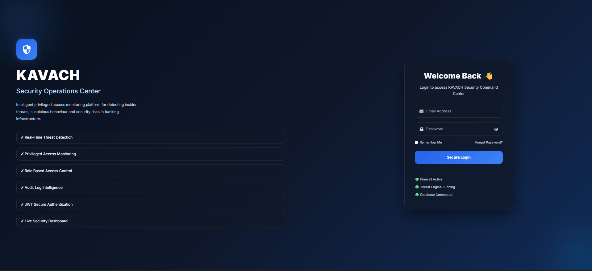

</p>

> Secure enterprise authentication with JWT, role-based access control, and privileged administrator login.

---

## 🛡️ Security Command Center

<p align="center">

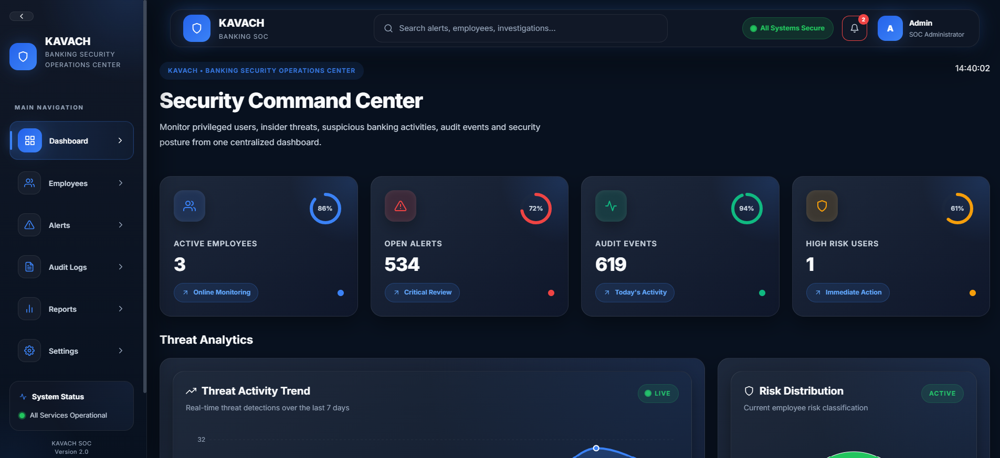

</p>

The central command dashboard provides real-time monitoring of employees, security posture, incident alerts, audit events, and operational health through interactive enterprise widgets.

---

## 📈 Threat Analytics & Risk Distribution

<p align="center">

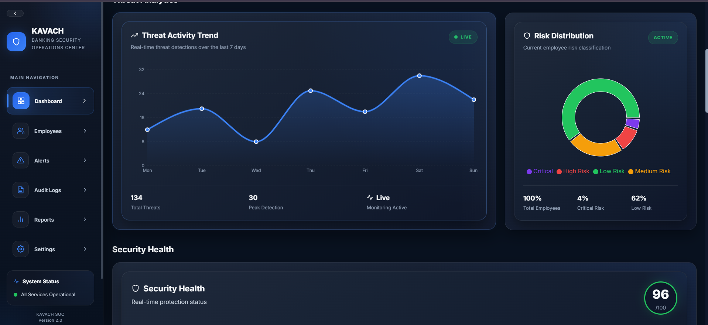

</p>

Interactive visualizations enable security teams to monitor threat activity trends, identify high-risk users, and understand organizational risk distribution.

---

## 🟢 Enterprise Security Health

<p align="center">

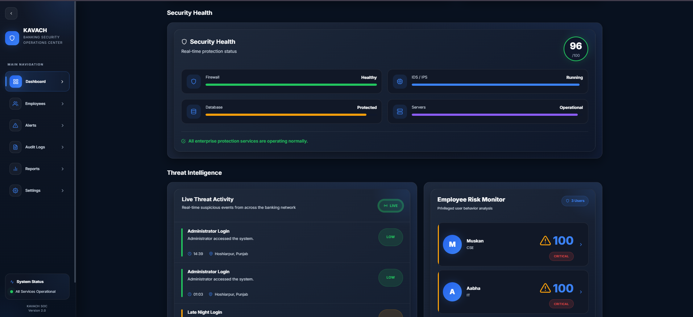

</p>

Monitor the operational status of critical enterprise services including Firewall, IDS/IPS, Database Protection, and Infrastructure Monitoring.

---

## 🚨 Threat Intelligence Center

<p align="center">

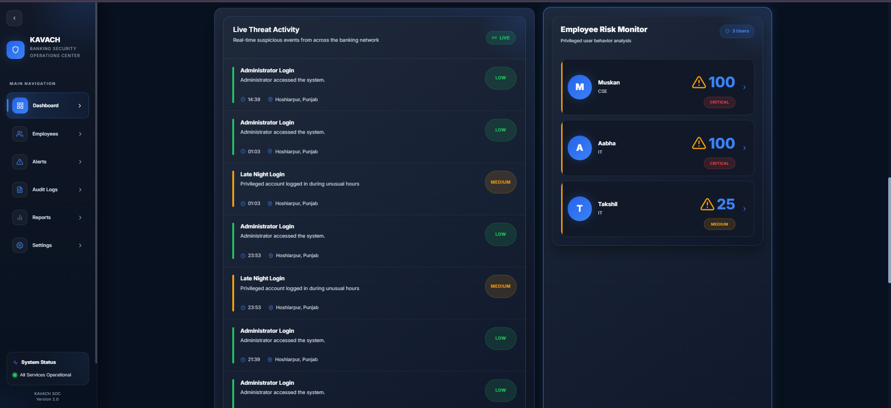

</p>

Real-time threat feeds allow SOC administrators to monitor suspicious activities, identify insider threats, and prioritize incidents based on severity.

---

## 👨‍💼 Employee Risk Intelligence Center

<p align="center">

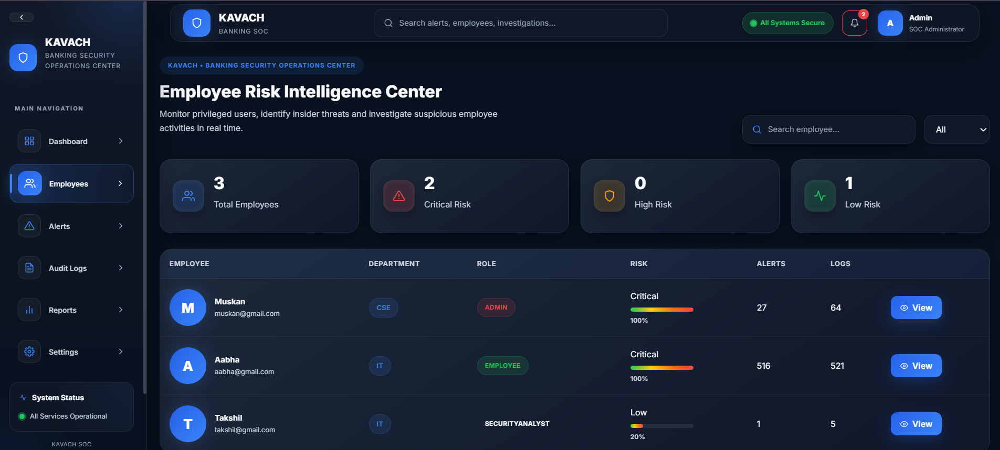

</p>

Track employee behavior, evaluate privilege misuse, monitor risk levels, and investigate suspicious activity from one centralized interface.

---

## 📋 Employee Investigation Profile

<p align="center">

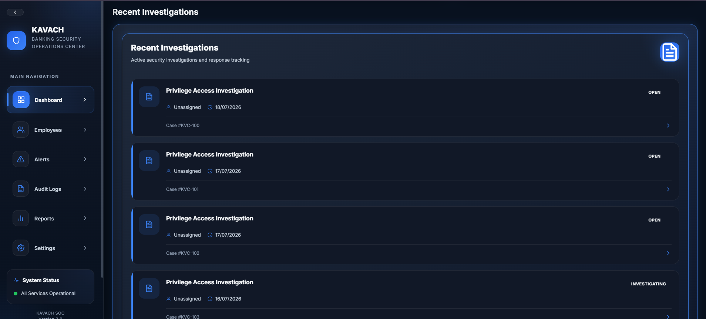

</p>

A dedicated investigation modal provides employee information, recent alerts, audit history, login activity, and security insights.

---

## 🚨 Incident Alert Management

<p align="center">

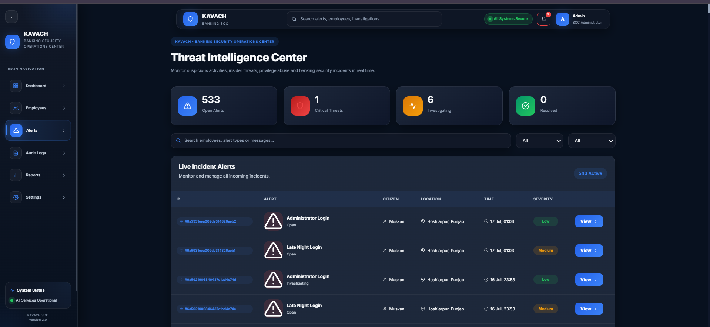

</p>

Manage incoming incidents with advanced filtering, severity classification, timestamps, locations, and investigation workflows.

---

## 📄 Security Audit Center

<p align="center">

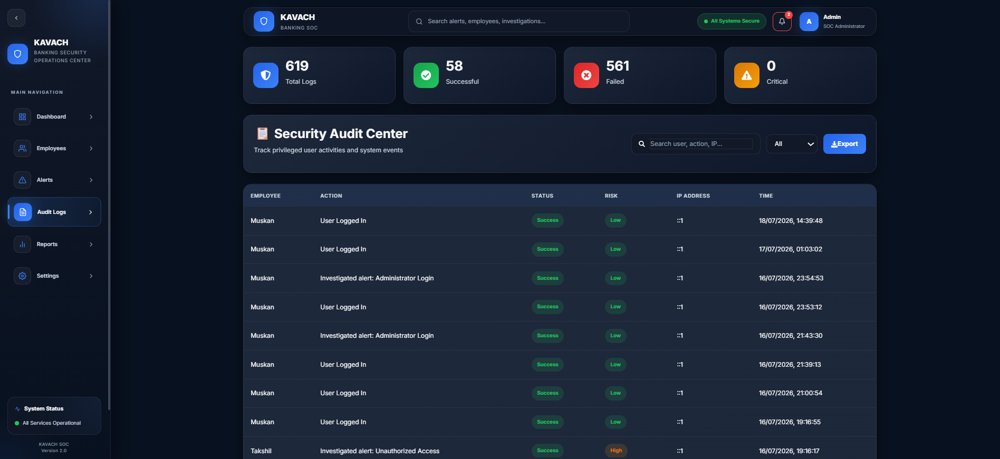

</p>

Comprehensive audit logging records every security event, authentication attempt, investigation, and administrator action.

---

## 📊 Enterprise Analytics & Reports

<p align="center">

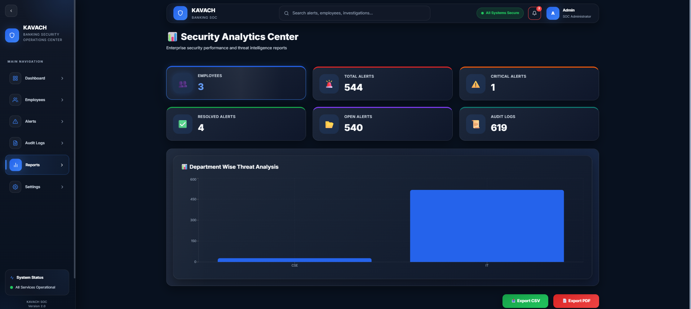

</p>

Generate department-wise reports, visualize enterprise statistics, and export security data in multiple formats.

---

## ⚙️ Security Configuration

<p align="center">

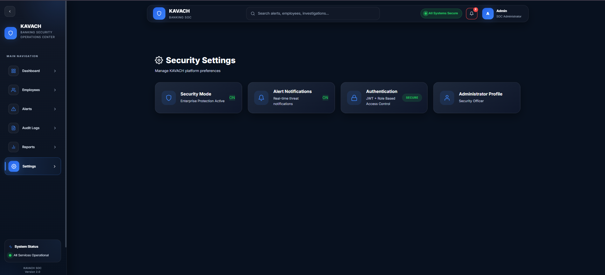

</p>

Configure enterprise protection settings, authentication policies, administrator profiles, and notification preferences.

---

# Core Modules

| Module | Description |
|---------|-------------|
| 🛡️ Security Dashboard | Real-time enterprise monitoring |
| 👨‍💼 Employee Intelligence | Employee behavior & risk profiling |
| 🚨 Alert Center | Incident detection & response |
| 📋 Audit Logs | Complete security audit trail |
| 📊 Analytics | Charts, KPIs & organizational insights |
| 📑 Reports | CSV/PDF export & statistics |
| ⚙️ Settings | Security configuration & preferences |
| 🔐 Authentication | JWT-based secure login |

---

# Enterprise Features

<div align="center">

| Feature | Capability |
|---------|------------|
| 🔐 Authentication | Secure JWT Login |
| 👥 Role Based Access | Multi-Level Authorization |
| 📊 Interactive Charts | Recharts Dashboard |
| 🌙 Enterprise Theme | Professional Dark UI |
| 📱 Responsive Design | Desktop & Tablet |
| 🚨 Threat Monitoring | Live Incident Tracking |
| 📋 Audit Logging | Security Event History |
| 📈 Analytics | Enterprise Reports |
| 📂 Export | CSV & PDF Support |
| ⚡ Performance | Optimized React + Vite |

</div>

---

# 🏆 Why KAVACH?

✅ Enterprise-inspired User Interface

✅ Banking Security Operations Center

✅ Modern Responsive Dashboard

✅ Role-Based Authentication

✅ Real-Time Threat Monitoring

✅ Employee Risk Intelligence

✅ Audit Log Management

✅ Interactive Security Analytics

✅ Professional Reporting System

✅ Clean Modular Architecture

---
# System Architecture

KAVACH follows a modern **MERN architecture** that separates the frontend, backend, authentication, and database into independent layers for scalability and maintainability.

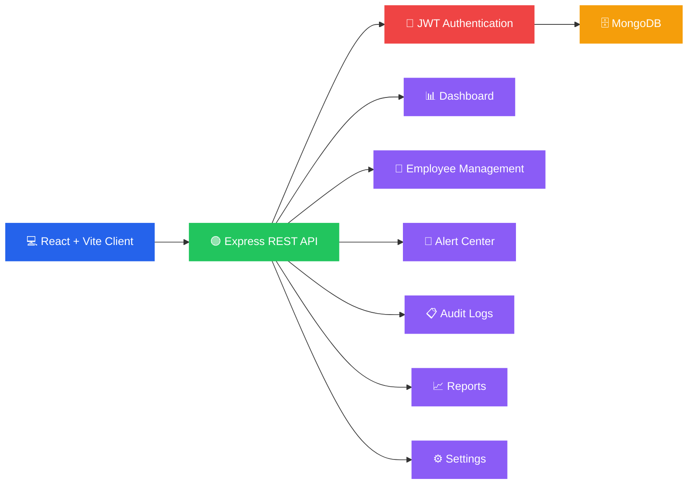

---

## Application Workflow

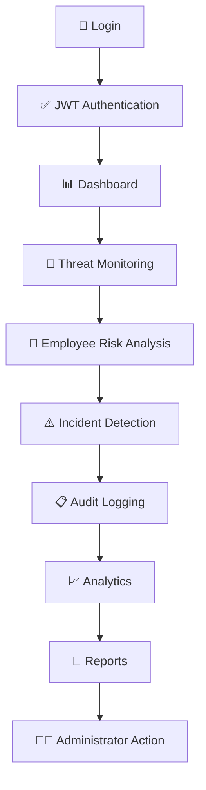
---

# 🛡 Security Workflow

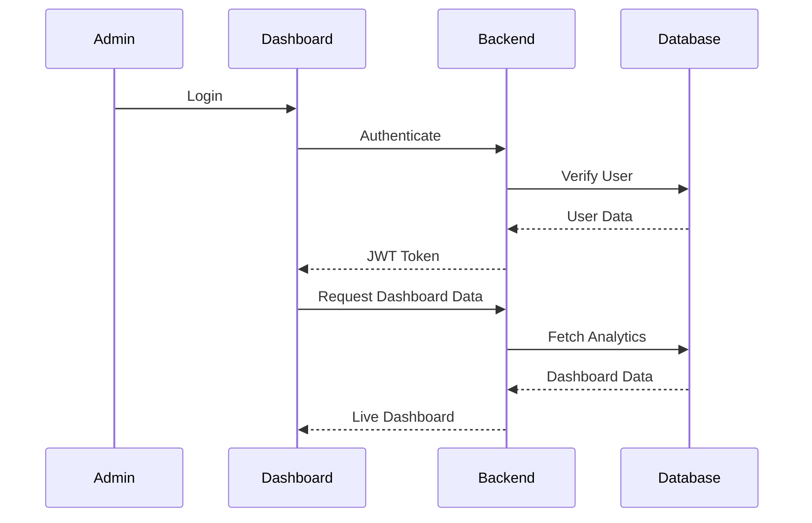

---

# Technology Stack

<div align="center">

| Technology | Purpose |
|------------|-----------|
| ⚛ React 19 | Frontend |
| ⚡ Vite | Build Tool |
| 🟢 Node.js | Backend Runtime |
| 🚂 Express.js | REST API |
| 🍃 MongoDB | Database |
| 🔐 JWT | Authentication |
| 📊 Recharts | Analytics |
| 🎨 CSS3 | UI Styling |
| 📦 npm | Package Manager |
| 🌐 REST API | Communication |
| 🖥 GitHub | Version Control |

</div>

---

# Development Stack

<table>

<tr>

<td align="center">

## Frontend

React 19

Vite

CSS3

React Icons

Recharts

</td>

<td align="center">

## Backend

Node.js

Express.js

REST APIs

JWT

Middleware

</td>

<td align="center">

## Database

MongoDB

Mongoose

Collections

Indexes

</td>

</tr>

</table>

---

# Project Structure

```text
KAVACH
│
├── 📂 frontend
│
│   ├── 📂 public
│   │
│   ├── 📂 src
│   │
│   │   ├── 📂 assets
│   │   ├── 📂 components
│   │   ├── 📂 context
│   │   ├── 📂 hooks
│   │   ├── 📂 pages
│   │   ├── 📂 services
│   │   ├── 📂 styles
│   │   ├── 📂 utils
│   │   │
│   │   ├── App.jsx
│   │   └── main.jsx
│   │
│   └── package.json
│
├── 📂 backend
│
│   ├── 📂 config
│   ├── 📂 controllers
│   ├── 📂 middleware
│   ├── 📂 models
│   ├── 📂 routes
│   ├── 📂 utils
│   ├── server.js
│   └── package.json
│
├── 📂 assets
│
│   ├── screenshots
│   ├── banner
│   └── logo
│
├── README.md
│
└── LICENSE
```

---

# Module Overview

| Module | Description |
|----------|-------------|
| 🏠 Dashboard | Enterprise Security Overview |
| 👨 Employees | Employee Risk Intelligence |
| 🚨 Alerts | Threat Monitoring |
| 📄 Audit Logs | Security Event Tracking |
| 📊 Reports | Analytics & Export |
| ⚙️ Settings | Enterprise Configuration |

---

# Installation Guide

## Clone Repository

```bash
git clone https://github.com/Muskan377750/Kavach.git

cd Kavach
```

---

## Install Frontend

```bash
cd frontend

npm install
```

---

## Install Backend

```bash
cd ../backend

npm install
```

---

## Environment Variables

Create a **.env** file inside backend.

```env
PORT=5000

MONGO_URI=your_mongodb_connection

JWT_SECRET=your_secret_key
```

---

## Start Backend

```bash
npm run dev
```

---

## Start Frontend

```bash
cd ../frontend

npm run dev
```

---

# Local Development

| Service | URL |
|---------|------------------------|
| Frontend | http://localhost:5173 |
| Backend | http://localhost:5000 |
| MongoDB | localhost:27017 |

---

# Project Statistics

<div align="center">

| 📊 Metric | Value |
|-----------|-------|
| Components | 40+ |
| Pages | 8+ |
| Dashboard Widgets | 20+ |
| Charts | 8 |
| REST APIs | 15+ |
| Authentication | JWT |
| Database | MongoDB |
| Responsive | ✅ |

</div>

---
# Roadmap

KAVACH is continuously evolving to provide enterprise-grade security monitoring and operational excellence.

| Status | Feature |
|:------:|---------|
| ✅ | Enterprise Dashboard |
| ✅ | JWT Authentication |
| ✅ | Employee Risk Intelligence |
| ✅ | Threat Intelligence Center |
| ✅ | Incident Alert Management |
| ✅ | Security Audit Center |
| ✅ | Interactive Analytics |
| ✅ | Report Generation (CSV/PDF) |
| ✅ | Enterprise Settings |
| 🔄 | Advanced Search & Filters |
| 🔄 | Notification Center |
| ⏳ | Email Notifications |
| ⏳ | SIEM Integration |
| ⏳ | Docker Deployment |
| ⏳ | Kubernetes Support |
| ⏳ | Multi-Tenant Architecture |
| ⏳ | Mobile Responsive App |

---

# Project Highlights

<div align="center">

| 🛡️ Security | 📊 Dashboard | 📁 Management |
|:-----------:|:------------:|:-------------:|
| JWT Authentication | Interactive Charts | Employee Monitoring |
| Threat Detection | Real-Time Analytics | Audit Logs |
| Role-Based Access | Risk Distribution | Reports |

</div>

---

# Contributing

Contributions are welcome!

### Getting Started

```bash
Fork the repository

↓

Create a new branch

git checkout -b feature/awesome-feature

↓

Commit your changes

git commit -m "Add awesome feature"

↓

Push the branch

git push origin feature/awesome-feature

↓

Open a Pull Request
```

Please ensure your code follows the existing project structure and coding standards.

---

# 🐞 Found a Bug?

If you discover any issues, please create an issue on GitHub.

### Bug Report should include

- Operating System
- Browser Version
- Steps to Reproduce
- Expected Behaviour
- Actual Behaviour
- Screenshots (if applicable)

---

# 💡 Feature Requests

Have an idea?

We'd love to hear it.

Please open a GitHub Issue with:

- Feature Description
- Benefits
- Possible Implementation

---

# 📌 Repository Information

| Property | Value |
|----------|-------|
| Repository | https://github.com/Muskan377750/Kavach |
| Hackathon | Finspark Hackathon 2026 |
| Team | VaultX Sentinel |
| Developer | Muskan |
| License | MIT |
| Frontend | React + Vite |
| Backend | Node.js + Express |
| Database | MongoDB |

---

# Meet the Team

<div align="center">

## 🛡️ VaultX Sentinel

### Project Developer

<table>

<tr>

<td align="center">


### Muskan

Full Stack Developer

React • Node.js • MongoDB

📧 m13347555@gmail.com

</td>

</tr>

</table>

</div>

---

# 📬 Contact

<div align="center">

### 📧 Email

m13347555@gmail.com

### 💻 GitHub

https://github.com/Muskan377750

### 📂 Repository

https://github.com/Muskan377750/Kavach

### 🎥 Demo Video

https://drive.google.com/file/d/1WUl_NhfI6qjfHs9AFAwB--n7jSaRj906/view

</div>

---

# 🏆 Built For

<div align="center">

## 🚀 Finspark Hackathon 2026

Enterprise Banking Security Operations Center

Designed for real-time monitoring, privileged access control, employee risk intelligence, and security analytics.

</div>

---

# License

Distributed under the MIT License.

Feel free to use, modify, and improve this project.

---

# 🙏 Acknowledgements

Special thanks to the technologies that made this project possible.

- React
- Vite
- Node.js
- Express.js
- MongoDB
- React Icons
- Recharts
- GitHub
- Open Source Community

---

# ⭐ Support the Project

If you like this project...

<div align="center">

### 🌟 Star this Repository

### 🍴 Fork the Repository

### 🛠️ Contribute

### 📢 Share with Others

</div>

---

# 📈 Project Status

```text
█████████████████████████████ 100%

Frontend              ████████████████████

Backend               ████████████████████

Authentication        ████████████████████

Dashboard             ████████████████████

Analytics             ████████████████████

Audit Center          ████████████████████

Reports               ████████████████████

Documentation         ███████████████████░
```

---

<div align="center">

# 🛡️ KAVACH

### Enterprise Banking Security Operations Center

> Detect • Monitor • Investigate • Protect

---

### Built with ❤️ by **VaultX Sentinel**

#### 👩‍💻 Developed by **Muskan**

📧 m13347555@gmail.com

🌐 https://github.com/Muskan377750

⭐ **If this project helped you, please consider giving it a star!**


</div>
